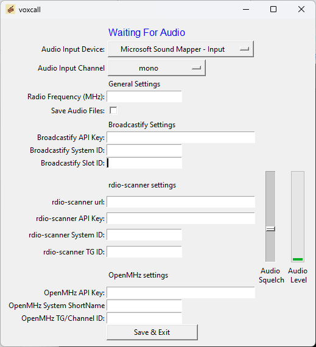

# voxcall
A sound-activated recorder with support for uploading audio to Broadcastify Calls.  For Windows and Raspberry Pi.

## Operation
- Connect a single-channel radio receiver to the sound card input on the computer.  If audio will be uploaded to Broadcastify Calls, the receiver should not be scanning multiple frequencies.
- Set the Audio Squelch using the slider.  Audio above the level of the slider will trigger recording.  The current audio level is shown adjacent to the slider.  Set the level of the slider while testing with the radio squelched and unsquelched.  
- To upload recorded audio files to Broadcastify Calls, enter information received from Broadcastify support
- When audio is detected above the Audio Squelch level, audio will be recorded until two seconds of silence is detected.  Once the recording ends, an MP3 fill will be created.  If valid Broadcastify Calls credentials are entered, the MP3 file will be uploaded.  If the "Save Audio Files" option is selected, the recordings will be saved to the /audiosave subdirectory
- There is a two-minute timeout timer.  If a recording exceeds two minutes (stuck squelch, noise, etc.) the recoding will stop, an error will be displayed, and no further activity will take place until the input audio goes below the Audio Squelch threshold, at which time normal operation will resume
- Something not working?  Check the log.txt file for errors and create an Issue here if needed

## Windows EXE
[ZIP Download](https://radioetcetera.site/radioetcetera/files/voxcall.zip)
- Uncompress the downloaded ZIP file
- Run the EXE

## Raspberry Pi executable binary (compiled for Raspbian Buster)
[TGZ Download](https://radioetcetera.site/radioetcetera/files/voxcall.tgz)
- Use a cheap USB sound card as the audio input - the Pi does come with an audio input
- Download using link above or via `curl -O https://radioetcetera.site/radioetcetera/files/voxcall.tgz`
- `tar zxf voxcall.tgz` to uncompress
- Install pulseaudio:
  - `sudo apt-get install pulseaudio`
- To run:
  - `/home/pi/dist/voxcall`

